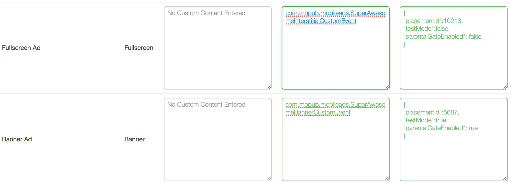
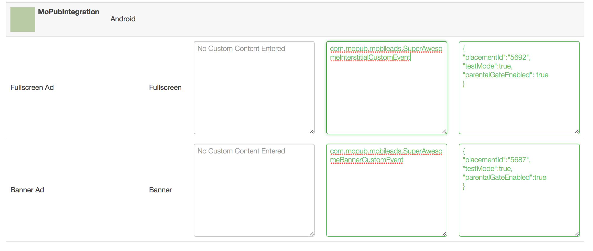

If you already have MoPub ads serving in your app, but want to integrate SuperAwesome as well, without having to directly use the AwesomeAds SDK, you can follow the steps below:

#### Integrate the SDK

The first thing you should do is integrate the SDK in your current app by following the instructions in [Getting Started / Adding the Library to Your Project](https://developers.superawesome.tv/docs/androidsdk/Getting%20Started/Adding%20the%20Library%20to%20Your%20Project?version=3).

This will add the SDK to your current project. 

#### Download Adapters

Next, you'll need to download the [samopub.jar](https://github.com/SuperAwesomeLTD/sa-mobile-sdk-android/blob/develop_v3/docs/res/samopub.jar?raw=true) archive, which you'll need to add to your project, in order to add three adapters classes:

  * [SuperAwesomeBannerCustomEvent.java](https://raw.githubusercontent.com/SuperAwesomeLTD/sa-mobile-sdk-android/develop_v3/demo/samopub/src/main/java/com/mopub/sa/mobileads/SuperAwesomeBannerCustomEvent.java)
  * [SuperAwesomeInterstitialCustomEvent.java](https://raw.githubusercontent.com/SuperAwesomeLTD/sa-mobile-sdk-android/develop_v3/demo/samopub/src/main/java/com/mopub/sa/mobileads/SuperAwesomeInterstitialCustomEvent.java)
  * [SuperAwesomeRewardedVideoCustomEvent.java](https://raw.githubusercontent.com/SuperAwesomeLTD/sa-mobile-sdk-android/develop_v3/demo/samopub/src/main/java/com/mopub/sa/mobileads/SuperAwesomeRewardedVideoCustomEvent.java)

If you don't want to use the samopub.jar file, you can download each .java file and add it to your project individually. You'll need to place them in a folder hierarchy as `com/mopub/sa/mobileads`, inside your `/app/src/main/java` folder.

#### Setup a MoPub Custom Network

From your MoPub admin interface you should create a `New Network`


Form the next menu, select `Custom Native Network`


You'll be taken to a new page. Here select the title of the new network


And assign custom inventory details for Banner and Interstitial ads:




Custom Event Class is:
  * for Banner Ads: `com.mopub.sa.mobileads.SuperAwesomeBannerCustomEvent`
  * for Interstitial Ads: `com.mopub.sa.mobileads.SuperAwesomeInterstitialCustomEvent`
  * for Rewarded Video Ads: `com.mopub.sa.mobileads.SuperAwesomeRewardedVideoCustomEvent`

Notice these are identical to the name of the files you downloaded in step one.

Custom Event Data is always required, and must be given in the form of  JSON:

```
{
	"placementId": 5692,
	"isTestEnabled": true,
	"isParentalGateEnabled": true
}

```

For rewarded video, two additional fields can be set:

```
{
	"shouldShowCloseButton": false,
	"shouldAutomaticallyCloseAtEnd": true
        "shouldLockOrientation": true,
        "lockOrientation": "LANDSCAPE" or "PORTRAIT" 
}

```

If you don't yet have a Placement ID for Awesome Ads, check out the [Getting Started / Registering Your App on the Dashboard](https://developers.superawesome.tv/docs/androidsdk/Getting%20Started/Registering%20Your%20App%20on%20the%20Dashboard?version=3) section.
