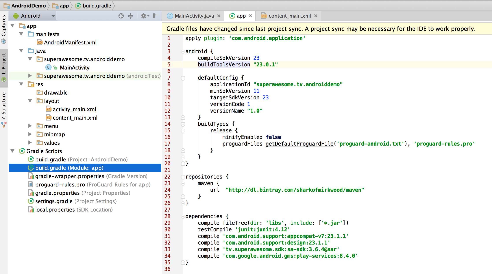
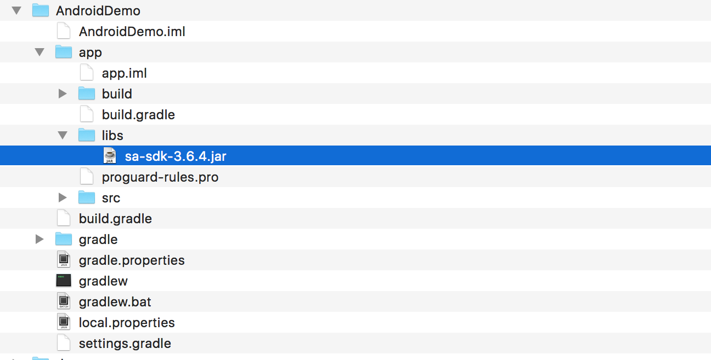
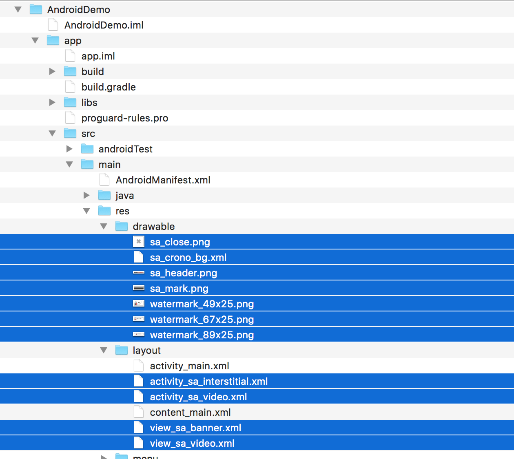
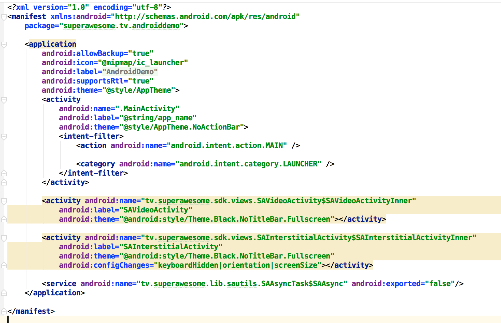

Getting started
===============

**Note**: This document assumes:

* an Android Studio project called **AndroidDemo**
* containing a single activity called **MainActivity**
* and a manifest file called **AndroidManifest**

Add the SDK through Gradle
^^^^^^^^^^^^^^^^^^^^^^^^^^

The simplest way of installing the AwesomeAds SDK in Android Studio is to download the AAR library through Gradle.

Just include the following in your module's **build.gradle** file (usually the file under MyApplication/app/):

.. code-block:: shell

    repositories {
        maven {
            url  "http://dl.bintray.com/sharkofmirkwood/maven"
        }
    }

    dependencies {
        compile 'tv.superawesome.sdk:sa-sdk:3.6.5@aar'
        compile 'com.google.android.gms:play-services:8.4.0'
    }

Add the SDK as a JAR library
^^^^^^^^^^^^^^^^^^^^^^^^^^^^

If you're running an environment which does not support Gradle, then you'll need to add the SDK manually.

1) Download `sa-sdk-3.6.5.jar <https://github.com/SuperAwesomeLTD/sa-mobile-sdk-android/raw/develop_v3/rdocs/source/res/sa-sdk-3.6.5.jar>`_

You'll need to add it to your project's **lib** folder, usually **AndroidDemo/app/libs**.
The libs folder should be located on the same level as the **src** and **build** folders.
Once it's there, in Android Studio you'll need to select it, right-click it and then **Add as Library**.

2) Download `sa-sdk-res.zip <https://github.com/SuperAwesomeLTD/sa-mobile-sdk-android/raw/develop_v3/rdocs/source/res/sa-sdk-res.zip>`_ and unzip it.

You'll find two folders inside:

* drawable: containing a bunch of PNG files; copy the PNG files inside your projects' **drawable** folder
* layout: containing a buch of XML files; copy the XML files inside your projects' **layout** folder

3) Add the following items in your AndroidManifest file, under the Application tag:

.. code-block:: xml

    <activity android:name="tv.superawesome.sdk.views.SAVideoActivity$SAVideoActivityInner"
              android:label="SAVideoActivity"
              android:theme="@android:style/Theme.Black.NoTitleBar.Fullscreen"></activity>

    <activity android:name="tv.superawesome.sdk.views.SAInterstitialActivity$SAInterstitialActivityInner"
              android:label="SAInterstitialActivity"
              android:theme="@android:style/Theme.Black.NoTitleBar.Fullscreen"
              android:configChanges="keyboardHidden|orientation|screenSize"></activity>

    <service android:name="tv.superawesome.lib.sautils.SAAsyncTask$SAAsync" android:exported="false"/>

This will register two new activities and one service for your application, all needed by the SDK.

4) At the end you'll also need to add Google Play Services as a dependency to the project, either as a JAR or through Gradle.

Finishing up
^^^^^^^^^^^^

The last thing to do, whether you've added the SuperAwesome SDK through Gradle or the Jar archive is to setup some permissions in the
AndroidManifest file:

.. code-block:: xml

    <uses-permission android:name="android.permission.INTERNET"/>
