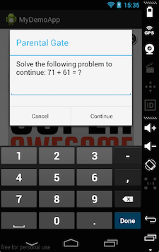

Parental Gate
=============

Parental gates are used in apps targeted towards kids to prevent them from engaging in commerce or following links out of
an app to websites, social networks, or other apps without the knowledge of their parent or guardian.
A parental gate presents an adult level task which must be completed in order to continue.

You can enable our parental gate on banners, interstitials and video ads.

.. code-block:: java

    banner.setIsParentalGateEnabled(true);

